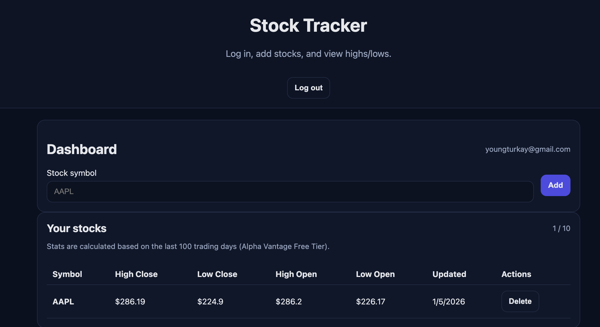

# 📈 Stock Tracker

A simple web application to track stocks and view their highest/lowest opening and closing prices.



[TRY IT NOW ->](https://lgivhan.github.io/stock-tracker/)

## 🚀 Features
- User authentication (sign up/login)
- Add stocks to your personal watchlist
- View highest/lowest open and close prices
- Data persists across sessions

## 🛠️ Setup Instructions

1. **Clone the repository**
```bash
   git clone https://github.com/yourusername/stock-tracker.git
   cd stock-tracker
```

2. **Set up your API keys**
```bash
   cp config.example.js config.js
```
   Then edit `config.js` and add your:
   - Supabase URL and Anon Key
   - Stock API Key (Finnhub, Alpha Vantage, etc.)

3. **Open the app**
   - Simply open `index.html` in your browser
   - Or use a local server (recommended):
```bash
     python -m http.server 8000
     # Then visit http://localhost:8000
```

## 🔧 Technologies Used
- HTML/CSS/JavaScript (Vanilla)
- Supabase (Authentication & Database)
- Alpha Vantage (Stock API)
- GitHub Pages (Hosting)

## 📝 Database Schema

### watchlists
- `id` (uuid, primary key)
- `user_id` (uuid, references auth.users)
- `symbol` (text)
- `created_at` (timestamp)

### stock_stats
- `id` (uuid, primary key)
- `watchlist_id` (uuid, FK -> watchlists.id, ON DELETE CASCADE)
- `user_id` (uuid, references auth.users)
- `symbol` (text)
- `highest_close` (numeric)
- `lowest_close` (numeric)
- `highest_open` (numeric)
- `lowest_open` (numeric)
- `latest_close` (numeric)
- `last_updated` (timestamp)

## 🔐 Security Note
⚠️ Never commit your `config.js` file with real API keys! It's already in `.gitignore`.

## 📄 License
MIT License - see LICENSE file for details
